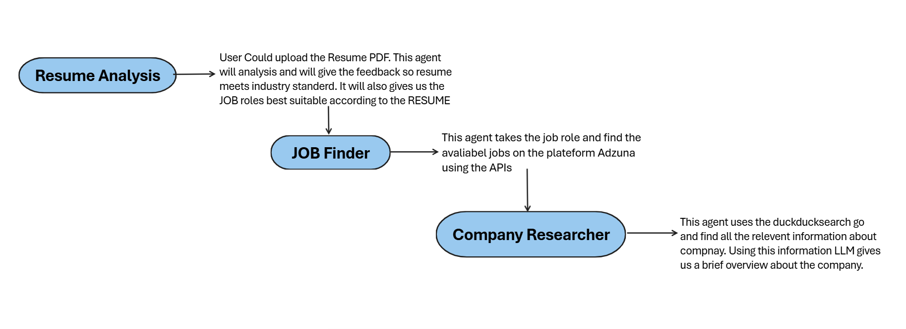

# AI Career Assistant 🚀

An AI-powered career platform that analyzes resumes, discovers matching job opportunities in real time, and performs automated company research — helping candidates move from resume upload to interview preparation faster.



---

## Overview

The **AI Career Assistant** is an end-to-end AI engineering project designed to automate and improve the job search workflow.

Instead of manually reviewing resumes, searching across job boards, and researching every company one by one, this system combines multiple AI agents into a single workflow.

A user uploads their resume.

The system instantly:

* extracts technical skills and experience,
* evaluates resume quality for ATS screening,
* predicts the best-fitting job roles,
* searches live job openings using external APIs,
* and researches target companies using web search.

The goal is simple:

**Reduce manual effort, increase job relevance, and help candidates prepare smarter.**

This project demonstrates practical AI engineering concepts including:

* **Retrieval-Augmented Generation (RAG)**
* **Multi-Agent Workflows with LangGraph**
* **Structured LLM Output Parsing**
* **Concurrent API Execution**
* **Resume Intelligence + Live Job Search Automation**

---

## Why This Project Matters

Job searching is repetitive and time-consuming.

A candidate often spends hours:

* updating resumes,
* identifying relevant roles,
* checking company details,
* reading reviews,
* and preparing for interviews.

This platform automates those repetitive steps with AI.

Instead of scattered tools, everything happens in one workflow:

**Resume Upload → AI Analysis → Job Discovery → Company Research**

The result:

* faster applications,
* better job targeting,
* stronger interview preparation.

---

## Core Features

## 1. Resume Analysis Agent 🧠

The Resume Agent processes uploaded PDF resumes and performs intelligent evaluation.

### Capabilities

### Extracts key skills

Detects:

* Programming languages
* Frameworks
* Tools
* Platforms
* Libraries

Example:

* Python
* React
* LangChain
* FastAPI
* SQL
* Docker

---

### ATS Resume Critique

Evaluates how well the resume may perform in ATS systems.

Provides:

* formatting feedback
* keyword gap analysis
* missing sections
* readability suggestions

Example output:

* Add measurable achievements
* Include more role-specific keywords
* Improve technical summary
* Optimize project descriptions

---

### Job Role Prediction

Based on resume content, predicts the top matching roles.

Example:

1. AI Engineer
2. Machine Learning Engineer
3. Backend Python Developer

These predicted roles are then passed automatically into the Job Finder Agent.

---

## 2. Real-Time Job Finder 🔎

This agent queries live jobs using the **Adzuna API**.

It takes the predicted roles and searches current openings.

### Returns

* Job title
* Company
* Location
* Salary estimate
* Application URL

Example:

### AI Engineer

Company: OpenAI Partner
Location: Bengaluru
Salary: ₹18–25 LPA

Apply →

---

### Backend Developer

Company: Product Startup
Location: Remote
Salary: ₹12–18 LPA

Apply →

---

### Performance Features

Uses **async concurrent API execution** to fetch multiple searches at once.

Benefits:

* faster loading
* parallel requests
* real-time results

---

## 3. Company Researcher Agent 🌐

Once jobs are returned, the Company Agent researches each employer.

Uses live internet search with **DuckDuckGo Search**.

### Collects

* recent company news
* business overview
* hiring trends
* employee sentiment
* culture insights

Example:

### Company Overview

**Company:** XYZ Labs

Recent activity:

* Raised Series A funding
* Expanding AI hiring
* Launching enterprise product

Employee sentiment:

* fast-paced
* learning-focused
* strong engineering culture

This helps candidates prepare before applying/interviewing.

---

## Architecture

High-level workflow:

```text
User Upload Resume
        ↓
Resume Analysis Agent
        ↓
Predicted Job Roles
        ↓
Parallel Adzuna API Search
        ↓
Job Listings
        ↓
Company Research Agent
        ↓
Final Dashboard Output
```

### Multi-Agent Flow

```text
Resume Agent
     │
     ├── ATS Critique
     ├── Skill Extraction
     └── Role Prediction
             ↓
      Job Finder Agent
             ↓
     Company Research Agent
             ↓
      Final UI Response
```

---

## Tech Stack

### Backend

* FastAPI
* Python
* Asyncio

---

### AI Orchestration

* LangChain
* LangGraph

---

### LLM Engine

Hugging Face Serverless API

Model:

```bash
meta-llama/Llama-3.1-8B-Instruct
```

---

### Search + Data

* Adzuna Developer API
* DuckDuckGo Search

---

### Document Processing

* PyPDF

---

### Frontend

* React.jsx

---

## Key AI Engineering Concepts Demonstrated

### Retrieval-Augmented Generation (RAG)

Resume + web data are retrieved before LLM reasoning.

This improves:

* relevance
* context accuracy
* response quality

---

### Structured Output Parsing

LLM responses are parsed into predictable formats.

Example:

```json
{
  "skills": [],
  "job_titles": [],
  "ats_feedback": []
}
```

Helps maintain clean downstream processing.

---

### Multi-Agent Orchestration

Separate agents handle:

* analysis
* search
* research

Improves modularity and scalability.

---

### Async Parallel Execution

API calls run concurrently.

Benefits:

* lower wait time
* faster job retrieval

---

## Example Workflow

### Upload Resume

PDF uploaded

↓

### Resume Parsed

Skills extracted

↓

### ATS Feedback Generated

↓

### Best Roles Predicted

↓

### Adzuna searched

↓

### Jobs displayed

↓

### Company research displayed

↓

### User clicks Apply + Research

---

## Future Improvements

Planned upgrades:

* LinkedIn profile integration
* Resume score dashboard
* Interview question generator
* Cover letter generator
* Skill gap recommendations
* Save/bookmark jobs
* Authentication
* Job application tracker
* Email alerts

---

Install dependencies

```bash
pip install -r requirements.txt
```

Run backend

```bash
uvicorn main:app --reload
```

Run frontend

```bash
npm install
npm run dev
```

---

## Final Pitch

The **AI Career Assistant** transforms job searching into an intelligent AI-driven workflow.

It combines:

* resume intelligence
* real-time hiring data
* company research automation

into one platform.

Built with modern AI engineering tools like:

* LangChain
* FastAPI
* Llama 3.1

It demonstrates how multi-agent systems can solve real-world workflows at scale.


---

## Author

Built by **Shubham Singh**

Focused on building AI systems using:

* Python
* LangChain
* LLM workflows
* AI automation
* developer tooling

⭐ If you found this useful, consider starring the repo.
